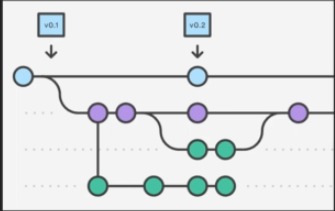

# What is Git
1. Source control, or version control, is a way of
tracking your files progress over time.
2. It is usually saved in a series of snapshots and
branches. which you can move back and forth
between.

 

#### Source control allows you to:
* Distribute your file changes over time
* Prevent against data loss/damage by creating
backup snapshots
* Manage complex project structures

## Why to use git ?
* The most popular source control software in the
world 

    other alterntives (Azure DevOps Server, Helix Core, AWS CodeCommit, Subversion, Rational ClearCase, Plastic SCM, Mercurial, OpenText AccuRev)
* Lots of documentation and support
* Lots Of integration with other applications
(SourceTree, Heroku, GitHub)

## Summary
* Git is a source/version control software.
* It is the most popular source control software in
the world.
* It has lots of integration with other programs.
giving it lots of value and demand.

# Git vs Github

## What GIthub is ?
* GitHub is an application alowing you to store
remote repositories. (it's in the name!)
* You can interact with your GitHub repository through
ttE push/pun system on your local macwne.
* GitHub is used
to allow other people to add
to the project (ex. Open source projects)
* GitHub allows more people than just yourself to see
and interact with the repository.

## The Difference
* Git is a source control software allowing you to take
snapshots and distribute your creations &
modifications over time.
* GitHub is an application alowing you to store and
interact with your repository on a remote server. as
well as adding more features (eg. Publicity,
licensing, collaborators)
* Git is the bones and flesh of source control. while
GitHub gives you the platform to work with your
repository easier.

# Downloads
1. download Git from its website
2. go to control panel / programs & features / windows features on or off / windows subsystem for linux check it is on
3. download ubruntu from microsoft store
   