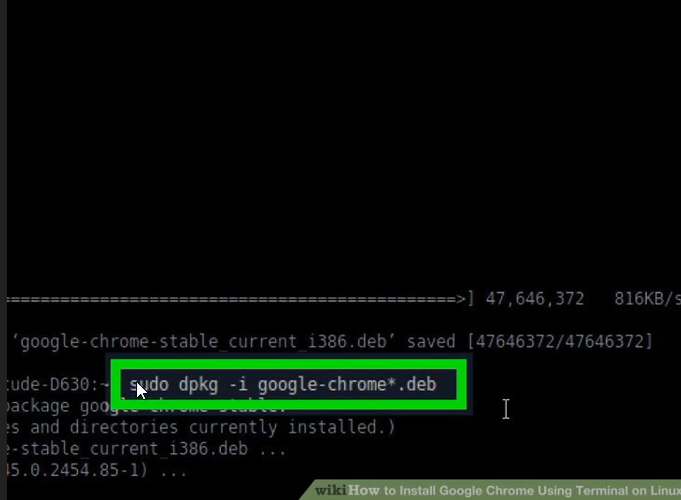

# INTRODUCTION To Terminal

* This section will completely focus on learning the
terminal.
* We will learn how to use the terminal from scratch,
starting from opening the program.
* The terminal is a required skill when using the raw
version of Cit.
* All developers need to learn how to use the terminal
at some point in their lives.

***
- [X] We will first look at the different parts of the
terminal, and what it can do
- [X] We will look at some of the differences between
a Windows & Unix terminal
- [x] We will learn what a 'shell' is and the most used
shells
***
## Console Commands

* We then move on to talk about some of the basic
commands you can use in the terminal.
* This includes moving between directories, adding
files, and creating directories.
* We also talk about some of the different
modifications you can make to a command (eg.
Help, flags)

***

> operating system is just a user friendly experience of what terminal do

### **Differences Between CMD vs PowerShell vs Bash**
| CMD  | PowerShell  | Bash  |
|-----------|-----------|-----------|
| CMD is the command line for Microsoft Windows operating system, with command-based features.	 | Powershell is a task-based command-line interface, specifically designed for system admins and is based on the .Net Framework.	 | Bash is a command-line and scripting language for most Unix/Linux-based operating systems.|
| The generated output is in the form of characters. | Powershell treats input and output as objects.	 | Like CMD, Bash also treats input and output as text structures.|
| CMD uses a text-based command-line interface. | Powershell has a more interactive graphical command-line interface CLI.	 | Bash has a simple user interface that is also text-based like CMD. |
| It comes as a default program in all the windows operating systems.	 | In windows 2007 and above, Powershell is a built-in program. Before that, it has to be installed as a separate program.	 | Linux and Unix systems mostly use Bash, and it is used from the very first day in Linux and Unix operating systems.
|

