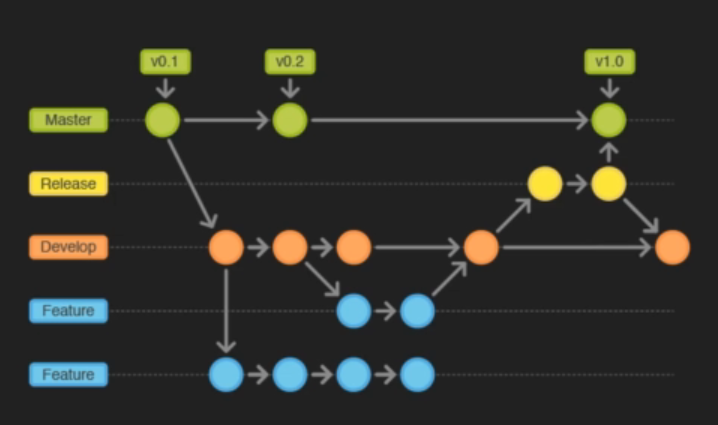
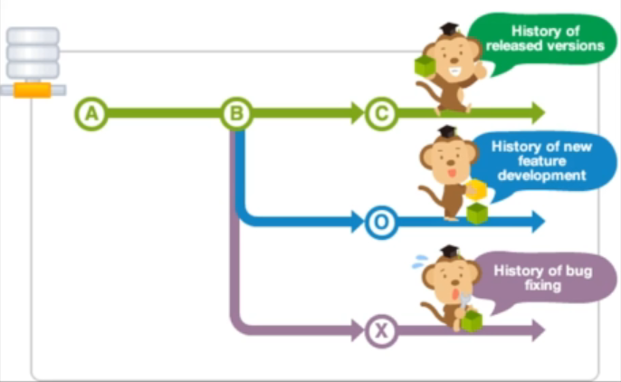
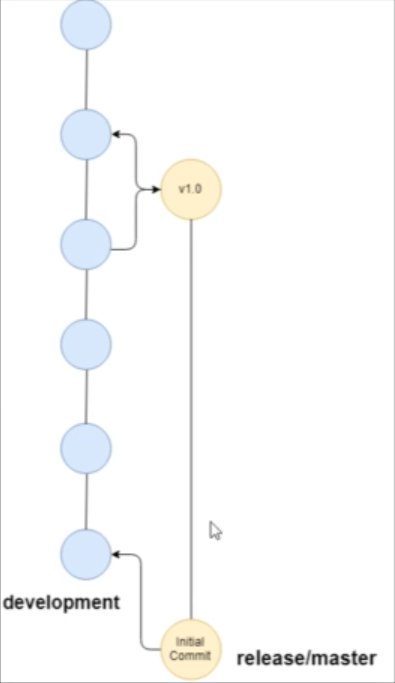

## Introduction
* First, we give an introduction to branches in Git.
* We talk about what they are & how they work
overall.
* It is important to have a conceptual
understanding of branches, as they are quite
complex.

## What are Branches & why should you use them ?  

### Introduction 
* Git branches are a way to create separate
development paths without overriding or
creating copies of your project.
* Branches can be added, deleted, and merged,
just like regular commits.

### uses of Branches  
Branches can be used to:
* Create separate development paths without
overriding progress
* Separate different end goals of your project
* Creates separate branches for each stage Of
development (release, development, fixes, master)

  

## working with branches  

This is our git project will look like:
  

>*  **git branch *branchname***: to make new branch  

>*  **git checkout -b *branchname***: to make new branch & switches to it    

>*  **git checkout  *master***: to switch to master branch    

>*  **git branch  -a**: to list all branches & the colored branch is the branch you are working on  

>* **git branch -d *branchname***: to delete a branch

## Editing Branches  

 the same as master branch but the oldest commit is the common commit between master & current branch

## Merging Branches  

> * **git merge *branchname*:** for merging branches to the desired branch  

>* **git rebase:** Git rebase is a powerful command that allows you to rewrite the history of your Git branch by moving its commits onto another branch. This can be useful for cleaning up your commit history, making it more linear, or incorporating changes from another branch without merging.