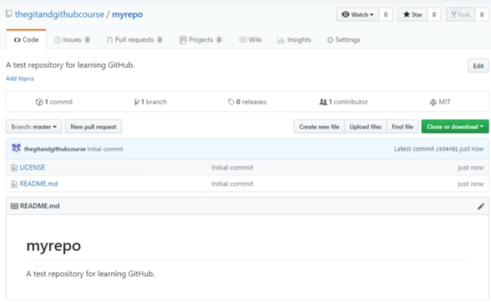

# Introduction  

* In this section, we will focus on GitHub, what it is,
and how to use it.
* We will create a GitHub account & interact with it
both through their platform, and through the
terminal.

  

* We will look at some of the history behind GitHub
and what its main purpose is.
* We will also look at why GitHub is so widely used
today & why you should use it.  

 

* We will then start to learn how to use GitHub, starting
with building an account.
* After building an account. we will look at exploring
GitHub, including building repositories. and
interacting with other people's repositories.
* We will look at creating and upkeeping our own
repository.  

# What is Github ?  

* Github is an application that allows you to store
remote repositories on their servers.
* They also provide a user-friendly platform to
interact with & manage your repositories.
* GitHub is public, allowing millions to share their
projects to the world

## Why use Github ?

GitHub allows you to:
* Have a portfolio of your best work.
* Open opportunities you might not have with a
local repository.
* Easy access from any device in any location.
* Industry standard for hosting Git repositories  

# Creating a Github account  

Creating an account is easy as any platform  

# Creating our first Github Repository  

create a Repo   
This is the view now

This tells how many commits, branches, releases, contributors & license type  

**Code:** to view the Repo
**Issues:** someone can find an issuse and list it So it can be fixed later  
**pull Requests:** anyone who wants access to pull the project to his machine  
**Projects:**  
**Wiki:** like the README.md file but bigger & you can list documentation  
**insights:** analytics for your Repo  
**settings:** it explains itself :)  
- you can invite collaborators  
- you can change branches
- you can integrate github to a web application  

# viewing other Repositories  

difference between colnning and forking:  
* **forking:** allows you to take a copy of a Repo on your github
* **clonning:** allows you to download this Repo on your mahcine and doesn't involove github  

# Download Github Repositories
  
## difference between downloading & clonning 

clonning makes it download to your local machine with .git folder & repo created
while when downloading it doesn't create a Repo to your machine