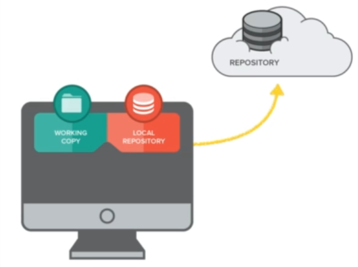
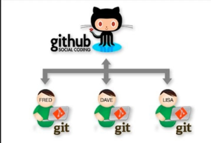

# Introduction

## Overview

* In this section, we will use our Git & GitHub skills
together to bring our project to the world.
* We will introduce lots of sharing and remote
access commands for Cit.

* We will look at some of the terminology related to
remote storage (remote repos, pull request, etc.)
* We will then look at the benefits of using remote
servers such as GitHub to store our work.  

* We will then start to learn the different
commands we can use in the terminal to
connect to GitHub.
* We will use Git & GitHub at the same time (for the
first time!)
* We will look at techniques we can use to
manage a remote repository. 

# Creating a new Remote Repo

>**git remote add origin *repository-url*:** to connect git & GitHUb Repo remotely  
* **origin**: is the default name for the remote repository. You can choose a different name if you prefer.  
> **git remote -v:**  It shows the remote name (origin by default) and the URL for both fetch and push operations.

# The push & pull system

* **Push:** When you push, you are sending your committed changes from your local repository to a remote repository (e.g., GitHub).  
  
* **Pull:** When you pull, you are fetching and merging changes from the remote repository into your local repository. This updates your local code with the latest changes made by others.  
  
In summary, the push system is proactive, producing or working ahead of demand, while the pull system is reactive, responding to current needs or orders.

# Pushing & pulling to & from a GitHub Repo

>**git pull origin master:** Retrieves the latest changes from a remote repository (usually called "origin") and merges them into your local working copy.
1. **git pull**: This is the main command that initiates the pulling process.
2. **origin**: This specifies the name of the remote repository you want to pull from. By default, the remote repository is named "origin" when you clone a repository.
3. **master**: This indicates the specific branch in the remote repository that you want to pull from. In this case, you're pulling from the "master" branch.

# Deleting Remote Branches
>**git push origin
--delete errO1:** to delete a branch remotely