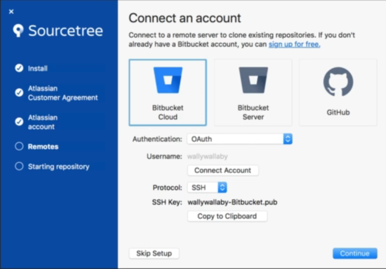
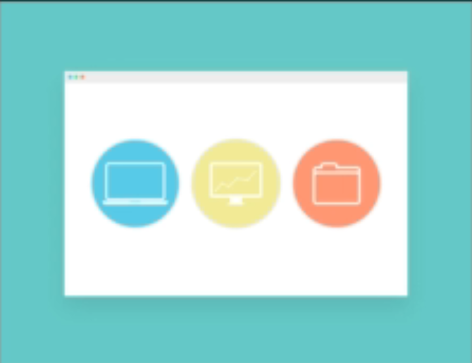

# Introduction 

 This section is going to teach us a new way to use git & github

* In this section, we will look at using all of the skills
we learned in a Git GUI.
* We will also 100k at the theory behind a GUI, and
why you might want to use it.
* This could give you an alternate way to use Git if
you are not comfortable with the terminal.

  

## Basic Features

* We will first look at SourceTree features for local
repositories (init, add, commit)
* We will also look at some of the differences
between a terminal and a GUI in terms of using
Cit.

  

## Network Features

* We will then start to look at using remote features,
such as push and pull.
* We will use these features to bring Git & GitHub
together using SourceTree.  

# what is Sourcetree ?

## What is a GUI ?

* A GUI, or Graphical User Interface is any software
that can allow the User to perform tasks through a
graphical interface.
* Most GUI's are built off of some system or liÜary
that can only be used through the terminal or
through programming, making it more user-
friendly  

    

Some examples of GUIs are:
*  Microsoft Windows Desktop
*  Google Chrome
*  Most Linux Distributions (Ubuntu, Debian)
*  Almost all software and applications for any device
has some sort of GIJI,

## About SourceTree

*  SourceTree is a Git GUI allowing you to interact
with your repositories through a graphical
interface.
*  It builds off of the core Git commands and
systems, however, it is executed through icons
and buttons instead of terminal commands.
*  SourceTree is used as an alternative to the
terminal when using Git,

# Installing SOurcTree
[Download Source tree from offical website](https://www.sourcetreeapp.com/)

# Setting up a new Repo

so easy,
1. go to local
2. browse your path
3. change the name you want

> **Notice:** It is very difficult to add remote origins to our repo so we add it from terminal like we have learned before