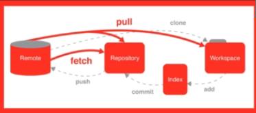
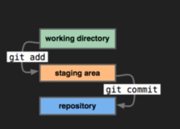
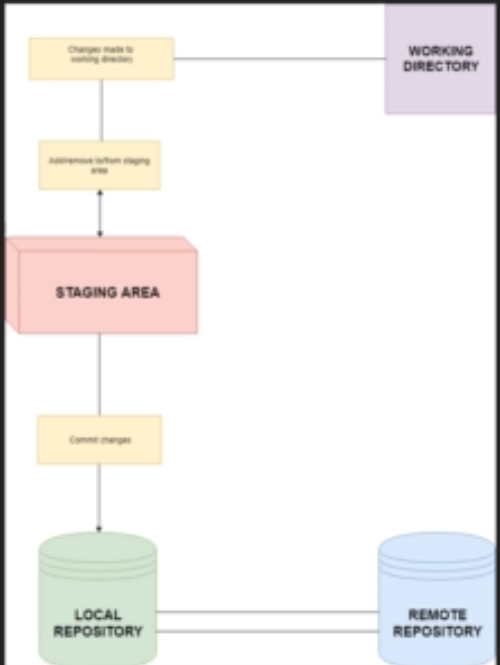
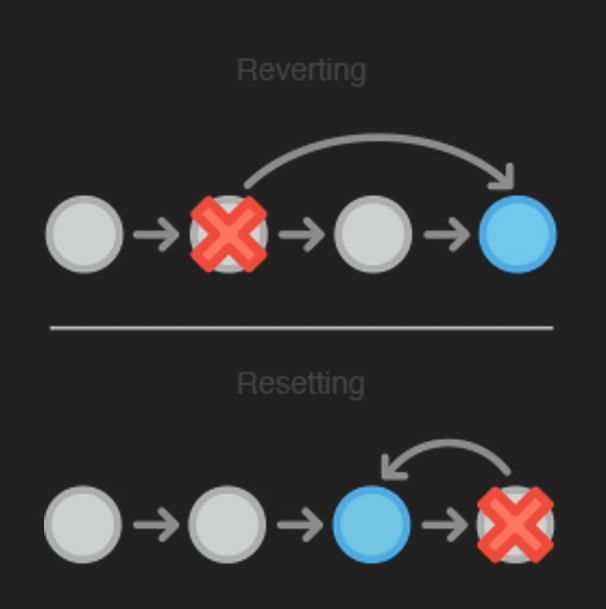
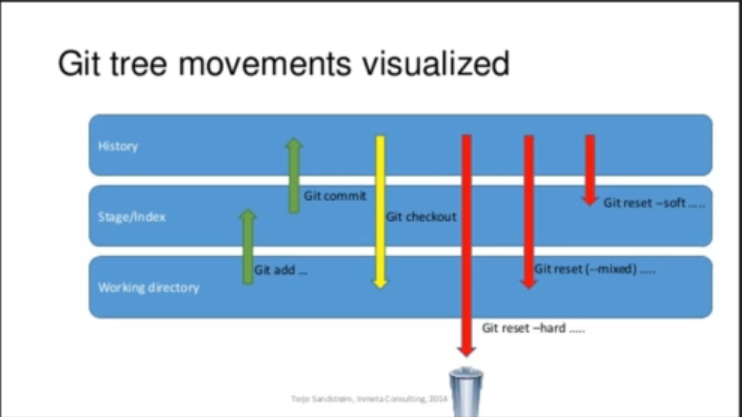

# Introduction

### GIt Basics
* Now that we have learned about the terminal,
* we will start to use Git.
We begin with a little bit of theory behind the Git
workflow and how it connects together.
* Then, we learn some of the basic commands to
use in Git.  

### Git theory
* Before using Git. we spend some time learning
how Git connects and works from start to finish
* We learn about multiple components. such as
the 'staging area' , and committing.

### Git commands

* Finally. we learn all Of the different basic
commands we can use in Git.
* On top of learning the commands, you will also
learn the concept behind each command, and
what it does.

[Git Commands Cheatsheet]([image.png](https://github.com/joshnh/Git-Commands))
------

# Git Workflow
* Before Git tracks a change, it goes through a
long chain of operations and tasks.
* Many of these tasks are user controlled, and are
required for changes to be tracked correctly.  

### Reposatories

* Repositories, usually calEd 'repos', store the full history and
source control Of a project.
* They can either be hosted locally, on a shared server, such as
GitHub.
* Most Reposatories are stored on GitHub. while core contributors
make copies of the repository on their machine and update the
repository using the push/pull system.
* Any repository stored somewhere Other than is called a
'remote repository'.

### Repos vs Directories

* Repositories are Of the entire project.
including all previous changes.
* Directories. or 'working directories' are projects at
their current state in time.
* Any local directory interacting with a repository is
technically a repository itself. however. it is better
to call these directories 'local repositories', as
they are instances of a remote repository.  
 
 

 ### WorkFlow Diagram

* This diagram shows a little bit about how the
basic Git workflow process works
* The staging area is the bundle of all the
modifications to the project that are going to be
committed.
* A 'commit' is similar to taking a snapshot of the
current state of the project, then storing it on a
timeline.

=========

# Creating Repo
* ### git init
---
for creating new Repo
> but make sure to be in the correct dir
>
# git add & remove files

* ### git add *filename.txt*
---
to add files for staging area

* ### git add .
---
to add all files in the dir to staging area

* ### git status
---
to check status of files if they are added or not to staging area

* ### git rm --cached *filename.txt*
---
to remove file from staging area
> git rm -f file.txt to force 

> **Note**  
> git rm : will remove files from staging area and dir  
> git rm --cached : will remove file from staging area only

* ### git config --global
It is used to configure Git settings at the global level, affecting all Git repositories on your system.
  
  
* ### git commit -m ""
This command is used to create a new commit in your Git repository.

* ### git log
to view commits history
> **git log --oneline:** to view many logs without date because with viewing date not so much commits can be viewed

* ### git checkout 
it allows you to go back in time to previous commit
> **git checkout *paste the commit ID***  
> **git checkout master** : to return back to latest commit  

# git reset & revert

the point is to go back to previous version in time permenantly 

* ### git revert 
it is safer than git reset as it go back in time to just 1 commit and it looks at this commit and revert the changes and creates new commit saying that it reverted the changes   
it's problem that it just go back for one commit  

>> **git revert *paste the commit ID***   
ctrl + x : to exit the opened screen

* ### git reset 
> **git reset *--hard commit ID*:** to go back to commit and delete all the recent commits  

# Types of git reset

 ## Soft

* Using the '--soft' flag will change your commit,
but will not remove any of the changes you have
made.
* For example, if you reset back one commit, your
environment would be the same, but the commit
you are on would be changed.
* This is useful if you are trying to get rid of a
problem with the commit (eg. Spelling error)

used to change the name of the commit

## mixed
* '—mixed' is the **default** setting for the reset
command. so you do not need to specify it.
* Instead of keeping everything staged and ready
to commit. it instead changes the •stage' to
match the commit you're reverting to.
* This doesn't remove the files; they are still in the
working directory. However. you have to commit
them again if you want to re-include them.
* This is primarily useful for when you want to
remove a file you accidentally committed.

## Hard
* '—hard' is the strongest out of the three, and the
most commonly used.
* Using this flag will reset the repository as if you
were still working on that commit; leaving no
data from any commits after it.
* This is mostly used when some irreversible error has
been made, and cannot be removed manually
without completely resetting the program.

# Creating .gitignore
gitignore it makes certain files and directories that you want to be untracked  

**what files should be gitignored** 
* static files
------

 to comment in .gitignore
use the # key  
  it should be created in the beginning of the dir  
 
  >***foldername/****  to ignore files in certain dir write 
  